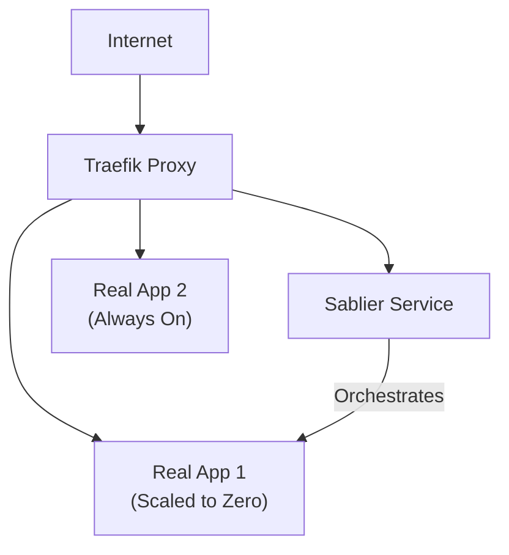

# Traefik Scale-to-Zero Proxy

A Traefik proxy configuration with **Sablier** integration for automatic scale-to-zero container management.

## 🚀 Overview

This setup allows you to automatically:
1.  **Stop**: Idles containers after a set period of inactivity (e.g., 5 minutes).
2.  **Start**: Wakes containers instantly when a web request arrives.
3.  **Display**: Shows a customizable "Loading" screen while containers are starting.

## 🏗️ Architecture



## 🛠️ Tech Stack
- **Traefik v3.6**: Modern, cloud-native application proxy.
- **Sablier v1.11.2**: Middleware for managing container lifecycles via Docker.
- **Isolated Network**: Uses a dedicated `idle_proxy` network for container communication.

## 📦 Quick Start

### 1. Create the Network
```bash
docker network create idle_proxy
```

### 2. Deploy the Proxy
```bash
docker compose up -d
```

## ➕ Adding Applications

To enable scale-to-zero for an application, add the following labels to its Docker configuration:

```yaml
traefik.enable=true
traefik.docker.network=idle_proxy
traefik.http.routers.APPNAME.rule=Host(`yourdomain.com`)
traefik.http.routers.APPNAME.entrypoints=web
traefik.http.services.APPNAME-svc.loadbalancer.server.port=80

# Sablier configuration
sablier.enable=true
sablier.group=APPNAME

# Middleware definition
traefik.http.middlewares.APPNAME-sablier.plugin.sablier.group=APPNAME
traefik.http.middlewares.APPNAME-sablier.plugin.sablier.sablierUrl=http://sablier:10000
traefik.http.middlewares.APPNAME-sablier.plugin.sablier.sessionDuration=5m
traefik.http.middlewares.APPNAME-sablier.plugin.sablier.dynamic.displayName=My App
traefik.http.middlewares.APPNAME-sablier.plugin.sablier.dynamic.theme=hacker-terminal

# Attach middleware to router
traefik.http.routers.APPNAME.middlewares=APPNAME-sablier

# CRITICAL: Let Traefik see the container when stopped
traefik.docker.allownonrunning=true
```

## 🧪 Verification
The container will automatically stop after the idle period (`sessionDuration`) has passed with no traffic.

---
*Powered by [Traefik](https://traefik.io/) and [Sablier](https://github.com/sablierapp/sablier).*
